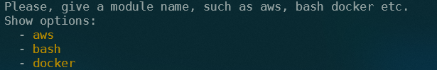
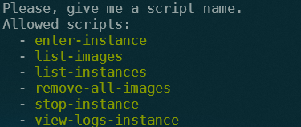

# lazy-dev-tools

Es un conjunto de scripts que uso habitualmente como aceleradores de las tareas diarias.
Todos los comandos ya existen en las correspondientes herramientas, pero recordar su sintaxis a veces es complicado.
El objetivo de éste proyecto es unir todas las tareas, scripts o ejecuciones repetitivas en una misma herramienta, de ahí su nombre.

El funcionamiento se basa en un laucher básico que se encarga por un lado de escanear los directorios donde están los scrips, y por otro lado comprobar que el script buscado existe.
El launcher se encarga de evaluar los parámetros que se le pasan, el primer parámetro se refiere a la carpeta mencionada, y el segundo se refiere al script que buscamos ejecutar.
De ésta manera los scripts se pueden agrupar dentro de carpetas llamadas modulos y cada script puede manejar alguna o algunas tareas preparadas.

## Install 

Actualmente solo está probado en linux, en la versión WSL de windows. 
Si te interesa agregar información para otras plataformas, ponete en contacto conmigo y podremos trabajar juntos para poder agregarlas.

## Linux 
Como primer paso hay que descargar el proyecto en alguna carpeta local

```bash
sh -c "$(curl -fsSL https://github.com/lflores/.lazy-dev-tools/blob/develop/tools/install.sh)" 

sh -c "$(curl -fsSL  https://raw.githubusercontent.com/lflores/.lazy-dev-tools/develop/tools/install.sh?token=GHSAT0AAAAAACMNUTF3T3SZXFK2U6EQGUP4ZNK5CXA)"
sh -c "$(curl -fsSL  https://raw.githubusercontent.com/lflores/.lazy-dev-tools/main/tools/install.sh)"
sh -c "$(curl -fsSL  https://raw.githubusercontent.com/lflores/.lazy-dev-tools/main/tools/uninstall.sh)"

alias ldt="~/bin/lazy-dev-tools"
```

```bash
git clone git@github.com:lflores/.lazy-dev-tools.git
```

El segundo paso es agregar la carpeta al path en la configuración de la consola, y ejecutar source o cerrar la terminal y volver a cargarla.

```bash
export PATH=~/<folder>/.lazy-dev-tools:$PATH
source ~/.zshrc
```

Con ésta configuración cargada podremos ejecutar lazy-dev-tools tipeando el comando en la consola.

También si no queremos escribir todo el comando podemos agregarle un alias para poder acceder más fácilmente.

```bash
alias ldt='lazy-dev-tools'
```

Ahora con el alias, solo tendremos que escribir 'ldt' en la consola o lo que sea que le hayamos puesto como alias. De ésta manera se mostrarán los módulos que hay disponibles.

## Use

Una vez configurado el launcher con solo ejecutarlo sin parámetros nos devolverá una ayuda de como ejecutar los scripts.
Con la primera ejecución devuelve la lista de los topicos/carpetas donde se encuentran los scripts dentro de la carpeta de scripts.
Cuando ingresamos el comando junto al primer parámetro elegido de la lista, nos devolverá una lista de los comandos/scripts que tendremos dentro del tópico elegido.
Agregado el segundo parámetro veremos la ejecución del script que puede requerir algún parámetro más.

```bash
ldt
```



Luego de colocar alguno de los módulos como primer parámetro luego del comando ldt se mostrará la lista de scripts disponibles.

```bash
ldt docker
```




## Tools

### Visual Code jq playground

Name: Visual Code jq playground
Id: davidnussio.vscode-jq-playground
Description: Visual Code integration with jq
Version: 4.3.5
Publisher: David Nussio
VS Marketplace Link: https://marketplace.visualstudio.com/items?itemName=davidnussio.vscode-jq-playground
